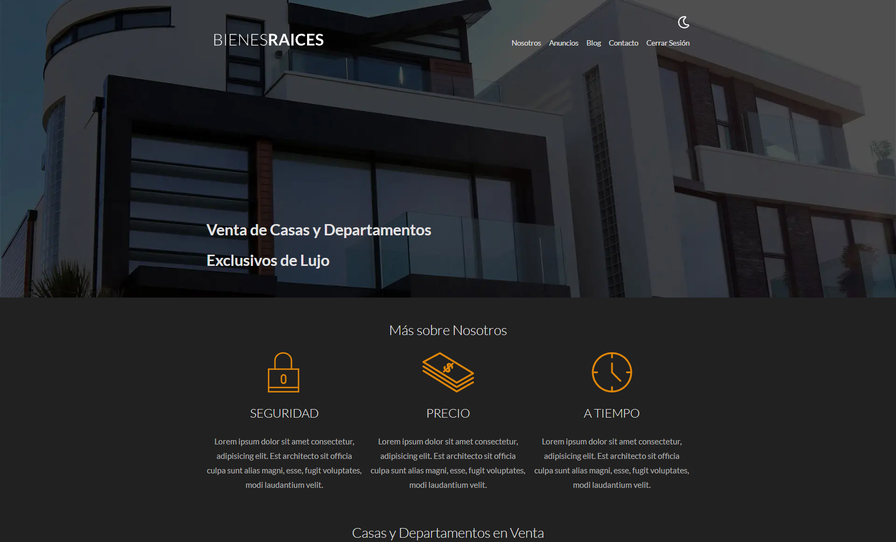
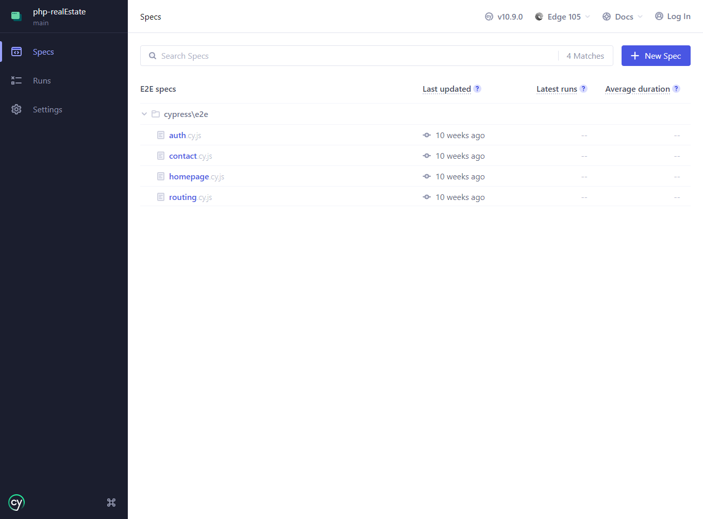

# Real Estate

This project is a simple real estate website, where you can see the properties and their details.

The website also has an admin panel, where you can add, edit and delete properties.

## General info

The project was created to practice the PHP language and improve my skills into it, evolving from spaghetti code to a more structured and organized code using the MVC pattern.

Also has tests with cypress, to ensure the correct functionality of the public pages on the website.

## Technologies

Project is created with:

- HTML 5
- SCSS
- JavaScript
- PHP 8.1
- MySQL
- Gulp
- Cypress

## Setup

To run this project, locally you need to have installed:

- PHP >= 8.1
- MySQL >= 8.0
- NPM >= 8.19.1 || Yarn >= 1.22.19
- Composer >= 2.4.1

After clone the repository you need to install the dependencies:

For NPM:

```bash
npm install
# or
yarn
```

For Composer:

```bash
composer install
```

Then you need to execute the `database.sql` file to create all the tables and insert the data.

After that you need to create a `.env` file in the includes directory, with the same structure as the `.env.example` file, (you can also make a copy and rename it as `.env`).

Then you need to run the gulp task to compile the scss and js files:

```bash
npm run dev
# or
yarn dev
```

And finally you can run the project with the next commands:

```bash
cd .\public\

php -S localhost:3000
```

By default this will to run the project on the port 3000, but you can change it in the same command.

<figure>
  
  <figcaption>Landing Page</figcaption>
</figure>

To access the admin panel you need to go to the `/login` route, and use the next credentials:

- Email: `test@test.com`
- Password: `123456`

After that you can access the admin panel and add, edit and delete properties.

<figure>
  
  <figcaption>Admin Panel</figcaption>
</figure>

Now it's your turn to create your estates!

## Tests

To run the tests you need to have installed cypress, and then you can run the next command:

```bash
npm run test
# or
yarn test
```

This will open an cypress window, where you can select your preferred browser to run the tests. Then you can see the next screen to select the test(s) to run:

<figure>
  
  <figcaption>Tests Screen</figcaption>
</figure>

## License

This project is open source and available under the [MIT License](https://choosealicense.com/licenses/mit/).
